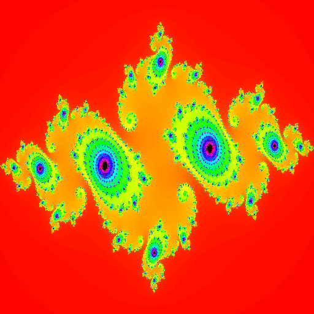

## main метод:

В методе `main` принимаются аргументы командной строки для задания ширины, высоты, части `Real` и `Imaginary` комплексного числа, а также имени выходного файла. Затем вызывается метод `generateJuliaFractal`, передавая ему эти параметры.

## generateJuliaFractal метод:

1. Создается пустое изображение `BufferedImage` заданной ширины и высоты.
2. Создается пул потоков (`ExecutorService`), который содержит фиксированное количество потоков, равное количеству доступных процессоров.
3. Затем запускается цикл для каждой строки изображения, где для каждой строки создается задача, которая вычисляет цвет каждого пикселя в этой строке.
4. После завершения всех задач пул потоков останавливается, и изображение сохраняется в файл.

## calculatePixelColor метод:

1. Этот метод рассчитывает цвет для каждого пикселя фрактала Julia Set.
2. Для каждого пикселя выполняется итеративный процесс, где комплексное число заменяется новым значением в зависимости от результатов предыдущих вычислений.
3. В зависимости от числа итераций определяется цвет пикселя.

### Результат:
C:\Users\dayof\.jdks\openjdk-19.0.2\bin>`java C:\Users\dayof\IdeaProjects\JuliaSet\src\main\java\org\fubar\Main.java -d 4096;4096 -c -0.75;0.11 -o C:\Users\dayof\Desktop\JuliaSet\123.png`

`Потоки успешно завершились.`

`Изображение сохранено в файл: C:\Users\dayof\Desktop\JuliaSet\123_JuliaSet.png`

